Данный бот был создан для обработки информации, поступающей через google таблицы. Он избавляет от
необходимости постоянно мониторить таблицы или загружать их для простановки стандартных сообщений
в ячейках таблицы.

Бот коммумицирует с 3 типами пользователей: администратором, координатором и наставником; а также производит
мониторинг и обновление рабочих таблиц Google.

-----------------------------------------------

**Администраторы** – имеют полный доступ к функционалу Бота. Присваивают статус пользователя и вносят о нем данные, 
а также удаляют пользователей. Видят все сообщения пересылаемые Ботом. Выгружают обработанные заявки для проведения 
анализа полученных в результате работы данных, могут видеть текущие не закрытые задачи, редактировать список задач,
получают сообщения о критическом сбое в работе программы

**Координаторы** – получают сообщения о новой задаче. Имеют возможность присвоить сотруднику статус верифицирован, 
оповестить наставников о сотрудничестве с другой компании и/или ошибке в полученных данных.

**Наставники** – получают сообщения об ошибках в задачах, о неполностью заполненных задачах со стороны 
наставников в УЦ. Имеют возможность изменить статус сотрудника и отправить сообщение об обновлении данных, о переводе 
задачу в Jira, об отказе от сотрудничества.

---------------------------------------------------

**Основная работа** - это просмотр заданных таблиц Google, обнаружение новых сотрудников, готовых к обработке
и подключению к компании. Когда бот обнаруживает данные о таком сотруднике, он считывает информацию из строки таблицы,
формирует сообщение и отправляет координаторам и администраторам в личные сообщения

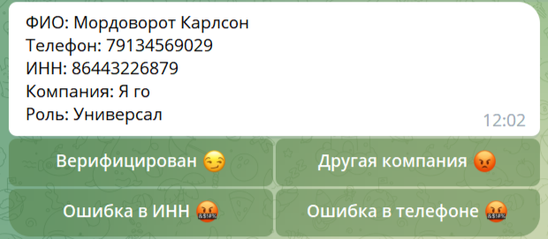

Координатор проверяет данные и верифицирует сотрудника, после чего нажимает кнопку «Верифицирован». 
Всем Координаторам приходит сообщение об активации сотрудника.
В случае если сотрудник уже сотрудничает или ранее сотрудничал с «Другой компанией», нажимается кнопка «Другая компания»
и координатору выделяется отдельное пространство для ввода данных (посредством FSM машины).
После ввода названия компании, Бот формирует сообщение и отправляет его наставникам в виде:

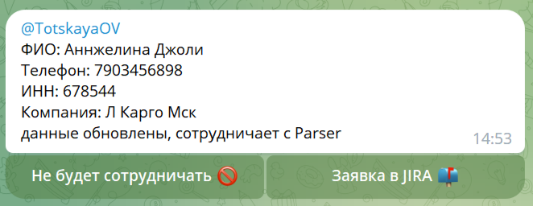

Сейчас коммуникация бота настроена так, что он отправляет сообщение в общий чат наставников, тегая ответственное лицо.
Но возможно и переключение на персональные сообщения.

Также Если Бот во время обновления данных обнаруживает нехватку данных об ИНН или телефоне в заявке, то он формирует 
список с такими заявками и берет паузу в их обработке продолжительностью 1 минуту. После этого он перепроверяет данные и 
исходят из их полноты, либо отправляет сообщение пользователям с ролью Координатор, либо отправляет сообщение наставнику:

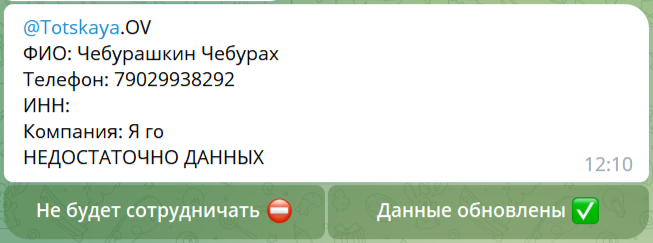

Подобное же сообщение может отправить и координатор посредством бота, при обнаружении ошибки в номере телефона или ИНН.

В процессе обновления данных бот также сравнивает полученные даные со своей внутренне БД на наличие дублирующих данных
за последние сутки. В случае нахождения, он оповещает всех пользователей. Это предотвращает заведение сотрудников с 
некорректными данными:

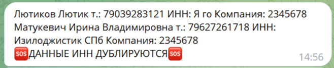

Также бот отслеживает непосредственно сам процесс обработки заявок. Заявка должна быть обработана в течении 5 минут.

Если происходит задержка, то бот оповещает об этом дважды. Через 5 минут и через 10:

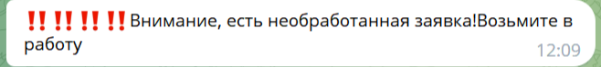

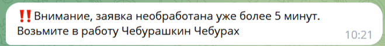

Администратор, помимо стандартных задач по типу добавления, удаления пользователей, может просматривать текущие 
задачи и корректировать их. А также регулировать оповещения о текущих задачах при необходимости

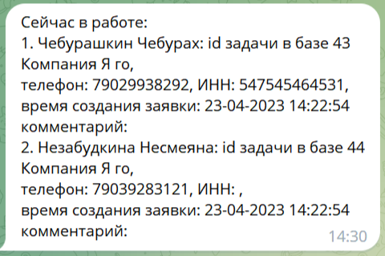

Бот поддерживает выгрузку данных о своей работе в двух вариантах: googlesheets и файл с расширением xlxs.
Структура таблицы выгружаемых данных:

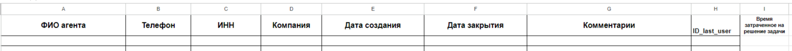

Так как Google имеет ограничение на обращение к своим ресурсам, бот обновляет данные раз в минуту, оставляя запас
на подключение вне времени обновления, на дополнительные запросы по уточнению данных или на простановку статусов
при их изменении сотрудникам. 

В случае, если возникает ошибка подключения на стороне Google, бот начинает увеличивать паузу между запросами.
Как только пауза между подключениями становится больше 3 минут, бот отправляет сообщение администраторам, предупреждая
о проблеме. Также он оповещает о возобновлении обновления:

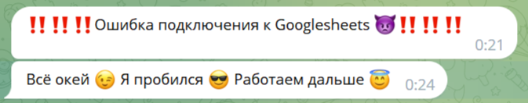

При этом каждая ошибка подключения продолжает логироваться в заданную группу для логов.

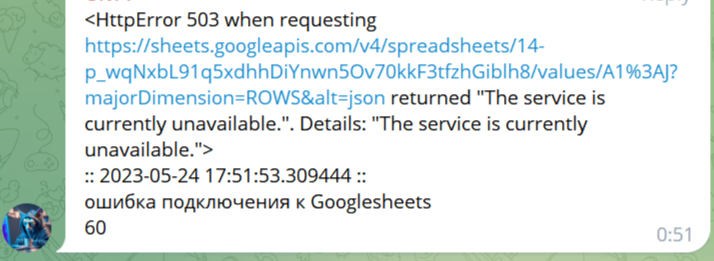

Бот прекращает мониторить таблицы и присылать оповещения в то время, когда отдел прекращает работать. При этом утром,
в момент начала рабочего дня бот присылает администраторам сообщения о том, что он приступил к обновлению. Данный
функционал был добавлен на случай перезагрузки серверов в ночное время.
*Изображение выбирается рандомно, из заданного списка*

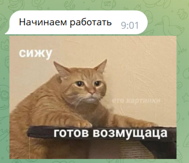

________________________________

Python

База данных SQLite (Библиотека sqlite3, подключение к базе данных SQLite) – хранится вместе с программой

UI – телеграмм

Подключение к Google sheets происходит посредством API ключа.

Короткие информирующие сообщения отправляются посредством https запроса.

Логирование ошибок: отдельная группа логирования с администратором.
